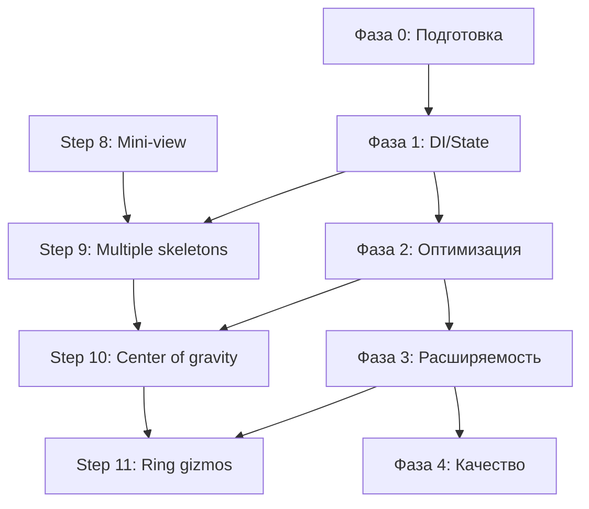

# [ARCHIVED] 2026-04-18

# План приоритетных улучшений архитектуры PoseFlow Editor

## Обзор

Этот документ содержит детальный план улучшений архитектуры PoseFlow Editor, сгруппированный по фазам реализации. План синхронизирован с существующим roadmap (Steps 8-11) и учитывает текущие ограничения проекта.

## Фаза 0: Подготовка (Неделя 1)

### Цель: Создание инфраструктуры для улучшений

**Задачи:**
1. **Создание ветки для рефакторинга**
   - `git checkout -b refactor/architecture-improvements`
   - Обновление PLAN.md с разделом "Architecture Improvements"

2. **Настройка инструментов мониторинга**
   - Внедрение `webpack-bundle-analyzer` для анализа размера бандла
   - Настройка `vitest` coverage reports
   - Добавление `eslint-plugin-architecture` для проверки архитектурных правил

3. **Создание baseline метрик**
   - Замер производительности: FPS, время IK вычислений, память
   - Замер времени сборки
   - Документирование текущих показателей

**Выходные артефакты:**
- Ветка `refactor/architecture-improvements`
- Файл `metrics/baseline.json` с текущими показателями
- Обновленный `PLAN.md` с разделом архитектурных улучшений

## Фаза 1: Dependency Injection и State Management (Недели 2-3)

### Цель: Улучшение тестируемости и управляемости состоянием

**Задача 1.1: Внедрение легковесного DI контейнера**
```
1. Установка `inversify` или создание собственного DI контейнера
2. Создание интерфейсов для ключевых сервисов:
   - IPoseService
   - IExportService  
   - ISkeletonGraph
   - IUndoStack
3. Рефакторинг PoseService для поддержки DI
4. Обновление компонентов для использования инжектированных сервисов
```

**Задача 1.2: Внедрение Zustand для управления состоянием**
```
1. Установка `zustand`
2. Создание stores:
   - usePoseStore (позы, активный скелет, режим манипуляции)
   - useUIStore (открытые модалки, активные инструменты)
   - useSettingsStore (настройки приложения)
3. Миграция состояния из PoseService и React state в stores
4. Обновление компонентов для использования stores
```

**Задача 1.3: Рефакторинг тестов под DI**
```
1. Обновление тестов для работы с инжектированными зависимостями
2. Создание mock-объектов для тестирования
3. Добавление интеграционных тестов для DI контейнера
```

**Критерии завершения:**
- Все сервисы доступны через DI контейнер
- Состояние управляется через Zustand stores
- Тесты проходят с использованием DI
- Обратная совместимость сохранена

## Фаза 2: Оптимизация производительности (Недели 4-5)

### Цель: Улучшение FPS и отзывчивости UI

**Задача 2.1: Оптимизация рендеринга Three.js**
```
1. Внедрение React.memo для Joint и Bone компонентов
2. Использование useMemo для вычисления производных данных
3. Оптимизация raycasting (ограничение частоты проверок)
4. Lazy loading для тяжелых Three.js компонентов
```

**Задача 2.2: Оптимизация алгоритмов IK/FK**
```
1. Профилирование FABRIK solver
2. Внедрение кэширования для повторяющихся вычислений
3. Оптимизация матричных операций
4. Добавление Web Workers для тяжелых вычислений (опционально)
```

**Задача 2.3: Оптимизация сборки**
```
1. Анализ bundle size
2. Настройка code splitting для routes
3. Tree shaking для Three.js
4. Оптимизация импортов
```

**Критерии завершения:**
- FPS ≥ 60 на средних системах
- Время IK вычислений < 5 мс
- Bundle size уменьшен на 20%
- Потребление памяти стабильно

## Фаза 3: Расширяемость и ограничения (Недели 6-8)

### Цель: Поддержка биомеханических ограничений и plugin architecture

**Задача 3.1: Расширение SkeletonGraph для ограничений**
```
1. Добавление JointConstraints интерфейса
2. Расширение SkeletonNode данными ограничений
3. Создание ConstraintSolver
4. Визуальная обратная свядь при нарушении ограничений
```

**Задача 3.2: Внедрение plugin architecture**
```
1. Создание интерфейсов для плагинов:
   - IExporterPlugin
   - IIKSolverPlugin  
   - IPoseFilterPlugin
2. Реализация PluginRegistry
3. Создание примера плагина (например, CCD IK solver)
4. Документация API для плагинов
```

**Задача 3.3: Улучшение IPC архитектуры**
```
1. Создание типизированных IPC каналов
2. Внедрение retry логики
3. Добавление health checks для всех компонентов
4. Мониторинг IPC latency
```

**Критерии завершения:**
- Поддержка ограничений для всех суставов
- Рабочая система плагинов с ≥1 примером
- Надежный IPC с мониторингом
- Документация для разработчиков плагинов

## Фаза 4: Качество и документация (Недели 9-10)

### Цель: Улучшение качества кода и документации

**Задача 4.1: Расширение тестового покрытия**
```
1. Доведение coverage до ≥80% для lib/ и services/
2. Добавление интеграционных тестов для IPC
3. Создание E2E тестов с Playwright
4. Добавление тестов производительности
```

**Задача 4.2: Улучшение документации архитектуры**
```
1. Создание C4 Model диаграмм:
   - Context diagram
   - Container diagram  
   - Component diagram
2. Sequence diagrams для ключевых сценариев
3. Обновление ADR с новыми решениями
4. Создание архитектурного decision tree
```

**Задача 4.3: Улучшение Developer Experience**
```
1. Создание devcontainer конфигурации
2. Автоматизация setup скриптами
3. Настройка pre-commit hooks
4. Документация процесса разработки
```

**Критерии завершения:**
- Test coverage ≥80%
- Полный набор архитектурной документации
- Упрощенный процесс onboarding новых разработчиков
- Автоматизированные проверки качества

## Интеграция с существующим roadmap (Steps 8-11)

### Параллельная реализация

```
Неделя 1-2: Step 8 (Mini-view) + Фаза 0 (Подготовка)
Неделя 3-4: Step 9 (Multiple skeletons) + Фаза 1 (DI/State)
Неделя 5-6: Step 10 (Center of gravity) + Фаза 2 (Оптимизация)
Неделя 7-8: Step 11 (Ring gizmos) + Фаза 3 (Расширяемость)
Неделя 9-10: Фаза 4 (Качество и документация)
```

### Зависимости между задачами



## Риски и митигации

### Риск 1: Нарушение обратной совместимости
**Митигация:**
- Поэтапный рефакторинг с сохранением старого API
- Feature flags для новых архитектурных решений
- Comprehensive testing перед мержем

### Риск 2: Увеличение времени разработки
**Митигация:**
- Приоритизация улучшений по impact/effort
- Параллельная работа над features и рефакторингом
- Регулярные демонстрации прогресса

### Риск 3: Сложность внедрения новых зависимостей
**Митигация:**
- Тщательная оценка новых библиотек
- Proof of concept для критических изменений
- Fallback на существующие решения при проблемах

## Метрики успеха

### Количественные метрики
1. **Производительность:**
   - FPS: ≥60 (среднее)
   - Время IK вычислений: < 5 мс
   - Время загрузки приложения: < 3 секунд

2. **Качество кода:**
   - Test coverage: ≥80%
   - Cyclomatic complexity: < 10 для критических методов
   - Количество `any` типов: 0 в production коде

3. **Размер приложения:**
   - Bundle size: ≤50 MB (развернутое)
   - Время сборки: < 60 секунд

### Качественные метрики
1. **Developer Experience:**
   - Время onboarding нового разработчика: < 2 часа
   - Количество шагов для запуска проекта: ≤5

2. **Расширяемость:**
   - Время добавления нового формата экспорта: < 4 часа
   - Время добавления нового алгоритма IK: < 8 часов

3. **Надежность:**
   - Количество критических багов в production: 0
   - MTTR (Mean Time To Recovery): < 2 часа

## Заключение

Этот план обеспечивает систематическое улучшение архитектуры PoseFlow Editor с минимальным disruption для текущей разработки. Рекомендуется начинать с Фазы 0 и двигаться последовательно, регулярно оценивая прогресс по установленным метрикам.

**Ключевой принцип:** Каждое архитектурное улучшение должно приносить измеримую пользу либо в производительности, либо в качестве кода, либо в developer experience.