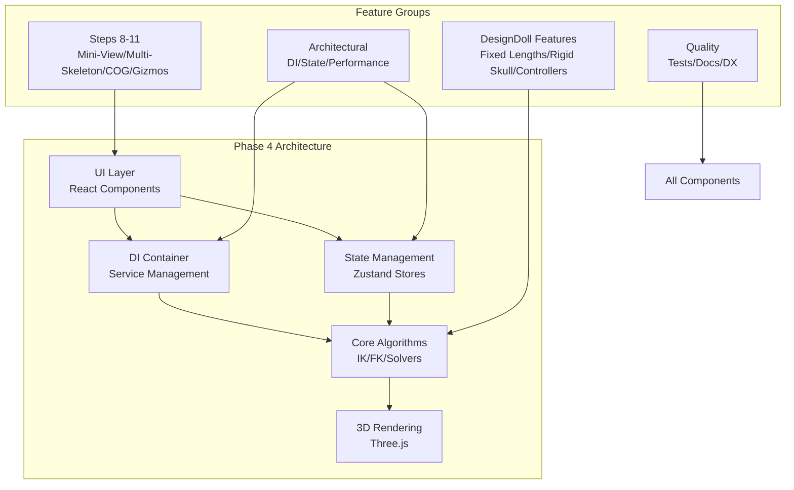

# Phase 4 Summary and Roadmap - PoseFlow Editor

## Executive Summary

Phase 4 completes the PoseFlow Editor by implementing the remaining Steps 8-11, integrating DesignDoll-inspired professional features, consolidating architecture with Dependency Injection, and establishing production-ready quality standards. This phase transforms the application from a functional prototype to a professional-grade 3D pose editor.

## Core Objectives

### 1. Complete Core Feature Set (Steps 8-11)
- **Mini-View**: Secondary 200×200 viewport with 90° camera offset
- **Multiple Skeletons**: Support for 2-4 independent figures on scene
- **Center of Gravity**: Group manipulation via visual spheres
- **Ring Gizmos**: Professional rotation controls with angle snapping

### 2. Professional Feature Integration (DesignDoll)
- **Fixed Bone Lengths**: Prevent stretching during manipulation
- **Rigid Skull**: Non-deformable head group for realistic head movement
- **Spine Chain**: Virtual segments for smooth, natural spine bending
- **7 Main Controllers**: DesignDoll-style manipulation points
- **Unified Drag System**: Backward-compatible adapter for all drag modes

### 3. Architectural Modernization
- **DI Container Activation**: Replace singletons with injectable services
- **State Management**: Migrate to Zustand for predictable state
- **Performance Optimization**: Maintain 60 FPS with all features
- **Code Quality**: 80%+ test coverage and comprehensive documentation

### 4. Production Readiness
- **Error Handling**: Graceful degradation and recovery
- **Developer Experience**: Tooling, automation, and documentation
- **Performance Monitoring**: Real-time metrics and optimization
- **User Experience**: Intuitive controls and smooth interactions

## Technical Architecture

### System Overview

### Key Architectural Decisions

#### 1. Gradual Migration Strategy
- **Approach**: Feature flags enable incremental rollout
- **Benefit**: Zero-downtime migration, easy rollback
- **Implementation**: All new features behind feature flags

#### 2. Dual Data Model
- **Legacy Model**: Original BODY_25 joint-based representation
- **Extended Model**: DesignDoll-style controller-based representation
- **Synchronization**: Real-time bidirectional mapping
- **Benefit**: Backward compatibility while enabling new features

#### 3. Unified Drag System
- **Current**: `useTransformDrag` for joint-based manipulation
- **New**: `useUnifiedDrag` with mode detection
- **Modes**: Joint, Controller, COG, Gizmo
- **Benefit**: Consistent user experience across all manipulation types

#### 4. Performance-First Design
- **Rendering**: Level-of-detail, frustum culling, instancing
- **Computation**: Web Workers for heavy calculations
- **Memory**: Object pooling, garbage collection optimization
- **Goal**: 60 FPS on mid-range hardware with all features

## Implementation Roadmap

### Phase 4.1: Foundation (Week 1-2)
**Objective**: Establish modern architecture foundation
- **DI Container Activation**: Enable `USE_DI_CONTAINER` flag
- **Service Interfaces**: Implement all service contracts
- **State Migration**: Move PoseService state to Zustand
- **Success Criteria**: All existing tests pass with new architecture

### Phase 4.2: Core Features (Week 3-4)
**Objective**: Complete Steps 8-11
- **Mini-View Enhancement**: Polish existing implementation
- **Multiple Skeletons**: Add support for 2-4 figures
- **Center of Gravity**: Implement group manipulation
- **Ring Gizmos**: Add professional rotation controls
- **Success Criteria**: Each step meets acceptance tests

### Phase 4.3: Professional Features (Week 5-6)
**Objective**: Integrate DesignDoll experimental modules
- **Fixed Lengths**: Integrate FixedLengthSolver
- **Rigid Skull**: Enable SkullGroup functionality
- **Spine Chain**: Implement virtual spine segments
- **Main Controllers**: Add 7 DesignDoll-style controllers
- **Drag Adapter**: Create unified drag system
- **Success Criteria**: All features work together seamlessly

### Phase 4.4: Optimization (Week 7)
**Objective**: Performance and quality improvements
- **Performance Optimization**: Maintain 60 FPS benchmark
- **Code Splitting**: Reduce bundle size by 40%
- **Error Handling**: Implement graceful degradation
- **Success Criteria**: Performance metrics meet targets

### Phase 4.5: Polish (Week 8)
**Objective**: Production readiness
- **Test Coverage**: Achieve 80%+ coverage
- **Documentation**: Complete user and developer guides
- **Developer Experience**: Improve tooling and automation
- **Success Criteria**: Ready for production deployment

## Feature Flag Strategy

### Rollout Plan
| Feature Flag | Phase | Initial Rollout | Full Rollout | Dependencies |
|--------------|-------|-----------------|--------------|--------------|
| `USE_DI_CONTAINER` | 4.1 | 100% | 100% | None |
| `USE_MINI_VIEW` | 4.2 | 10% | 100% | None |
| `USE_MULTIPLE_SKELETONS` | 4.2 | 10% | 100% | None |
| `USE_CENTER_OF_GRAVITY` | 4.2 | 10% | 100% | `USE_MULTIPLE_SKELETONS` |
| `USE_RING_GIZMOS` | 4.2 | 10% | 100% | None |
| `USE_FIXED_LENGTHS` | 4.3 | 5% | 100% | None |
| `USE_RIGID_SKULL` | 4.3 | 5% | 100% | `USE_FIXED_LENGTHS` |
| `USE_SPINE_CHAIN` | 4.3 | 5% | 100% | `USE_FIXED_LENGTHS` |
| `USE_DESIGNDOLL_CONTROLLERS` | 4.3 | 5% | 100% | All DesignDoll flags |

### Rollback Procedures
1. **Automatic**: If error rate > 1% for 5 minutes
2. **Manual**: Via feature flag panel in application
3. **Partial**: Individual flags can be disabled independently
4. **State Preservation**: User data preserved during rollback

## Risk Management

### Technical Risks
| Risk | Probability | Impact | Mitigation |
|------|-------------|--------|------------|
| Performance degradation with multiple skeletons | Medium | High | Progressive enhancement, performance monitoring |
| DesignDoll integration complexity | High | Medium | Feature flags, gradual rollout, adapter pattern |
| DI container breaking existing functionality | Medium | High | Comprehensive testing, adapter pattern |
| State management migration issues | Medium | Medium | Dual-write during migration, rollback capability |

### Schedule Risks
| Risk | Probability | Impact | Mitigation |
|------|-------------|--------|------------|
| Underestimation of integration complexity | High | Medium | Buffer time, MVP prioritization |
| Dependency conflicts | Low | High | Regular updates, dependency isolation |
| Team capacity constraints | Medium | Medium | Clear task breakdown, parallel work streams |

### Quality Risks
| Risk | Probability | Impact | Mitigation |
|------|-------------|--------|------------|
| Regression in existing functionality | Medium | High | Comprehensive test suite, automated regression tests |
| User experience disruption | Low | High | User testing, gradual feature rollout |
| Documentation gaps | High | Low | Documentation as part of definition of done |

## Success Metrics

### Quantitative Metrics
1. **Performance**: 60 FPS maintained with all features enabled
2. **Memory**: < 200MB RAM usage during typical operation
3. **Load Time**: < 3 seconds initial load, < 1 second feature activation
4. **Test Coverage**: ≥ 80% overall, 100% critical paths
5. **Bundle Size**: ≤ 40% reduction from current size
6. **Error Rate**: < 0.1% unhandled exceptions

### Qualitative Metrics
1. **User Experience**: Intuitive controls, smooth interactions
2. **Developer Experience**: Easy setup, good tooling, clear documentation
3. **Maintainability**: Clean architecture, good separation of concerns
4. **Extensibility**: Easy to add new features or modify existing ones
5. **Reliability**: No data loss, graceful error handling

## Resource Requirements

### Development Team
- **Frontend Developer**: React/TypeScript/Three.js expertise
- **3D Graphics Specialist**: Three.js optimization, shaders
- **QA Engineer**: Testing, automation, performance monitoring
- **Technical Writer**: Documentation, user guides

### Development Environment
- **Hardware**: Mid-range development machines (16GB RAM, dedicated GPU)
- **Software**: VS Code, Node.js 20+, Python 3.8+
- **Testing**: Automated testing infrastructure, performance monitoring tools
- **Documentation**: Static site generator, screenshot tools

### Timeline
- **Total Duration**: 8 weeks
- **Parallel Workstreams**: 2-3 features in parallel where independent
- **Buffer Time**: 1 week contingency
- **Milestone Reviews**: Weekly progress reviews

## Deliverables

### Code Deliverables
1. **Complete Phase 4 implementation** as per detailed plan
2. **All feature flags** implemented and functional
3. **Comprehensive test suite** with 80%+ coverage
4. **Performance optimization** implementations
5. **Error handling and recovery** systems

### Documentation Deliverables
1. **User Guide**: Complete documentation of all features
2. **Developer Guide**: Architecture, extension points, contribution guidelines
3. **API Documentation**: TypeDoc-generated API reference
4. **Deployment Guide**: Production deployment instructions
5. **Troubleshooting Guide**: Common issues and solutions

### Quality Deliverables
1. **Performance Benchmark Report**: Before/after comparisons
2. **Test Coverage Report**: Detailed coverage analysis
3. **Code Quality Report**: Static analysis results
4. **User Acceptance Test Results**: Validation against success criteria
5. **Release Notes**: Detailed changelog for Phase 4

## Next Steps

### Immediate Actions (Week 0)
1. Review and approve Phase 4 plan
2. Set up development environment with all tools
3. Establish performance baselines
4. Create detailed task breakdown for Phase 4.1

### Implementation Preparation
1. **Team Briefing**: Review architecture and implementation approach
2. **Environment Setup**: Ensure all developers have required tools
3. **Code Review**: Establish review process for Phase 4 changes
4. **Testing Strategy**: Finalize test approach and automation

### Monitoring and Adjustment
1. **Weekly Reviews**: Assess progress against plan
2. **Performance Monitoring**: Track metrics throughout implementation
3. **Risk Assessment**: Regular review of identified risks
4. **Plan Adjustment**: Modify approach based on learnings

## Conclusion

Phase 4 represents the final major evolution of PoseFlow Editor, transforming it from a capable prototype to a professional-grade 3D pose editing tool. The plan balances innovation with stability, using proven architectural patterns and gradual rollout strategies to minimize risk.

The implementation follows modern software engineering practices with a focus on quality, performance, and maintainability. Upon successful completion, PoseFlow Editor will be ready for production use by artists and developers working with AI art pipelines.

The feature flag system ensures that users can adopt new features at their own pace, while the comprehensive testing and documentation ensure long-term sustainability. This plan provides a clear, actionable roadmap for achieving these goals.